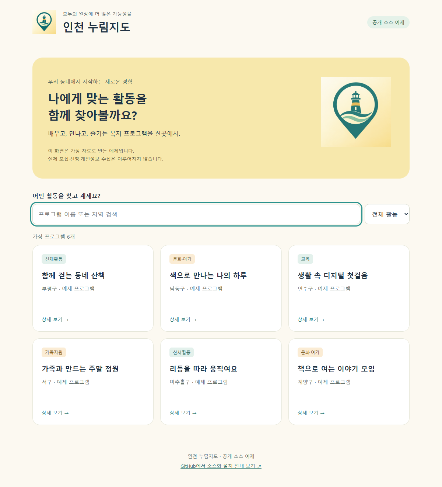

# 인천 누림지도 · 공개 소스

> **운영진 검토용:** [실제 운영 소스 보기](https://github.com/heo032990-cell/incheon-nurimmap-open-source/tree/codex/production-v109-review) · 공개판과 운영판은 설정과 일부 구성에 차이가 있습니다.

현재 최신 버전은 **v109**입니다. 관리자 전용 페이지와 설문 좌우 미리보기·페이지 구분·끌어 이동·안내 동의 통합을 지원합니다. [변경 및 적용 안내](docs/CURRENT_VERSION.md)를 확인하세요.

인천 지역 장애인복지 프로그램을 찾고 신청하며, 기관 담당자가 모집·신청·설문을 관리하는 웹 서비스입니다. 검색·신청 접근성, 다중 첨부, 관리자 전용 페이지 및 실시간 설문 편집 기능을 포함한 공개 소스입니다.

- [운영 서비스](https://incheon-nurimmap.netlify.app)
- [공개 소스](https://github.com/heo032990-cell/incheon-nurimmap-open-source)
- [공모전 제출 안내](docs/CONTEST_SUBMISSION.md)
- [설치 및 실행](docs/SETUP.md) · [이용자 가이드](docs/USER_GUIDE.md) · [관리자 가이드](docs/ADMIN_GUIDE.md)

## 바로 실행

Node.js 24 이상이 필요합니다.

```sh
npm ci
npm run check:public
npm test
npm run build
npm start
```

브라우저에서 http://localhost:4173 을 엽니다. 접속 설정이 없으면 **가상 프로그램으로 구성된 별도 예제 화면**이 표시됩니다. 예제는 검색·분류·상세 보기만 제공하며 실제 신청이나 관리자 기능은 수행하지 않습니다.

전체 신청·관리 기능은 본인의 Supabase 및 Google 계정을 연결해야 합니다. [설치 안내](docs/SETUP.md)를 따르세요. 운영 서비스의 데이터·계정·접속 키는 포함하지 않았습니다.

## 주요 기능

- 복지 프로그램 검색과 대상·활동 분류, 상세 안내
- 프로그램별 신청 항목·동의 항목, 파일 제출
- 모집 방식과 신청 상태·대기 순번 관리
- 기관 담당자와 총괄 관리자 권한 구분
- 설문 작성·배포와 Google Drive 저장 연계
- 신청 내역 조회·수정·취소, 인쇄와 접근성 보조 기능

이 저장소에는 프런트엔드, 서버 함수, Google Apps Script, 신규 설치용 데이터베이스 구조, 회귀 테스트가 들어 있습니다. 현재 사용하는 서버 코드와 신규 설치 SQL만 남기고 구형 중복 파일을 정리했습니다. 파일명은 버전 번호 대신 기능 이름으로 통일했습니다. 이 저장소의 파일은 모두 현재 배포에 사용하는 구성입니다. 신규 설치에는 schema.sql → storage-setup.sql → retention.sql → guardian-consent.sql 순서로 현재 설치 파일을 실행합니다.

## 공개판과 운영판

운영판의 노란 배경 등대 파비콘과 짧은 탭 제목을 반영했습니다. 공개판의 본문 로고는 재배포가 가능한 자체 등대 이미지입니다. 운영 사이트의 인천시 공식 심볼은 이 저장소에 포함하지 않습니다. 검색 노출 주소는 example.org로 치환했으므로 직접 배포할 때 본인 주소로 바꾸세요.

새 기관 설치를 위해 설정을 분리하고 초기 스키마 및 예제를 추가했습니다. 운영 서비스의 설정과 데이터는 변경하지 않았습니다. 예제 화면 검증과 단위 테스트가 외부 서비스 전체의 운영 검증을 대신하지는 않습니다.

## AI 활용과 라이선스

AI는 개발 과정에서 코드 작성·개선, 검증 보조, 시각 자료 제작에 활용했습니다. 현재 공개 소스에 이용자 질문을 처리하는 LLM 챗봇이나 AI 추천 API는 없습니다. [AI 활용·외부 자료](docs/AI_AND_SOURCES.md)를 참고하세요.

자체 소스와 문서는 [MIT License](LICENSE)로 공개합니다. 누구나 라이선스 고지를 유지하며 사용·수정·재배포할 수 있습니다. 외부 라이브러리·서비스·기관 상표에는 각 권리자의 조건이 적용됩니다. [외부 저작물 안내](THIRD_PARTY_NOTICES.md)를 함께 확인하세요.

## 예제 화면

아래는 별도 가상 자료 예제이며 운영 화면 전체의 복제는 아닙니다.



## 접근성

검색 결과 개수·모집상태 안내, 신청 단계 제목으로 초점 이동, 신청 버튼으로 초점 복귀, 동의·설문 질문명 연결을 반영했습니다. [변경 및 정리 내역](docs/CURRENT_VERSION.md)을 참고하세요.

## 신청서·증빙자료 첨부
신청서·증빙자료를 최대 10개까지 나누어 추가하고 개별 삭제할 수 있습니다. 합계 10MB 이하이며 Google Drive에는 각 원본으로 저장합니다. **기존 설치를 업데이트할 때는 Apps Script를 먼저 새 버전으로 배포한 뒤 웹파일을 반영하세요.** Supabase·SQL 변경은 없습니다. [현재 버전 및 검증](docs/CURRENT_VERSION.md)을 참고하세요.

## 관리자와 설문 편집
관리자 버튼은 새 탭의 로그인 페이지로 이동합니다. 로그인 후 설문 관리에서 왼쪽 문항 편집과 오른쪽 실시간 미리보기를 함께 사용합니다. 문항 도구는 편집 칸 옆에 있으며, 첫 문항은 설문 제목 다음에 바로 추가합니다. 추가 페이지의 제목·설명, 문항 끌어 이동, 안내와 동의 방식을 설정할 수 있습니다.

버전 표기의 기준은 package.json의 109.0.0이며, 현재 구성은 [현재 버전 안내](docs/CURRENT_VERSION.md)에서 확인합니다. 소스 파일명에는 개별 버전 번호를 붙이지 않습니다.

문항은 별도 끌기 버튼 없이 제목 영역을 잡아 옮깁니다. 페이지에는 위·아래 버튼을 표시하지 않으며, 일반 문항에는 키보드용 이동 버튼을 유지합니다.

출력물에서는 페이지 제목을 전체 너비의 구분선과 페이지 번호로 표시하고 질문 번호는 연속으로 이어집니다. Google PDF에는 현재 backend/google-apps-script.gs를 기존 웹 앱의 새 버전으로 배포해야 적용됩니다. 이미 저장된 PDF는 자동 변경되지 않습니다.

## 현재 보호자 동의·보유기간 기능
만 14세 미만 신청에는 아동 서명과 보호자 이름·추가 서명·동의를 함께 기록합니다. 서버와 데이터베이스에서도 검증합니다. 개인정보 보유기간은 접수 당시 기준으로 보관하며 만료된 데이터베이스 기록을 정기적으로 정리합니다. Google Drive 자료와 Storage 파일은 별도의 정리 대상입니다. 남은 Storage 첨부가 있는 기록은 자동 삭제를 보류합니다.
